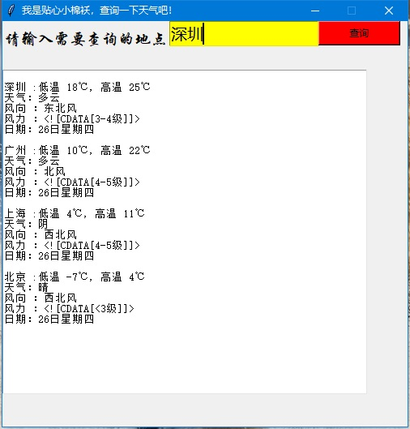
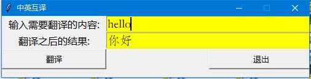
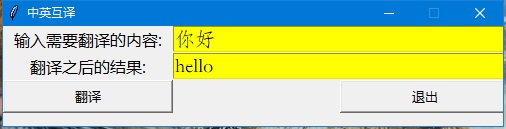
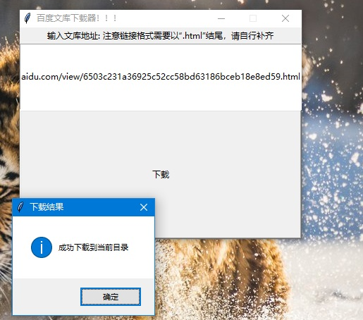
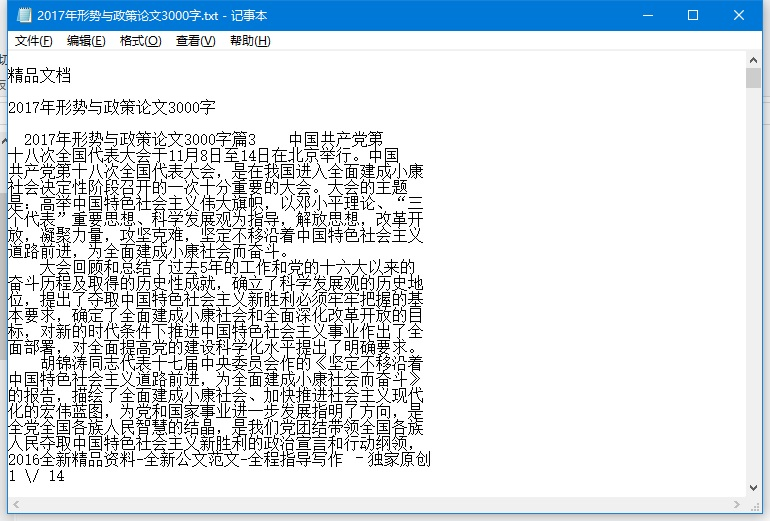
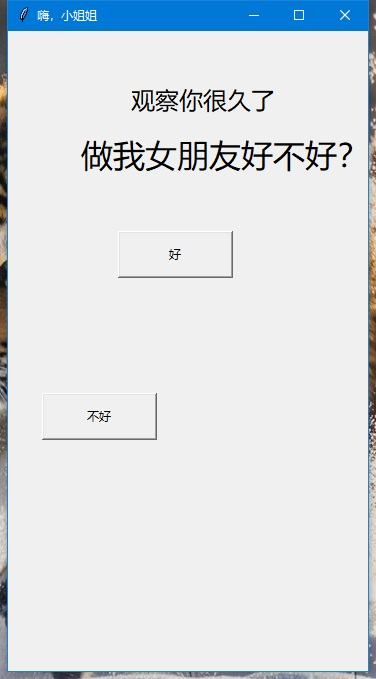
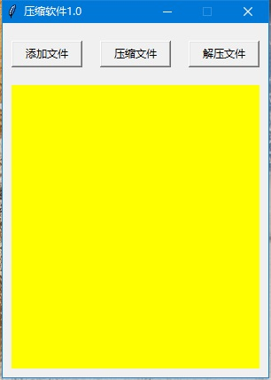
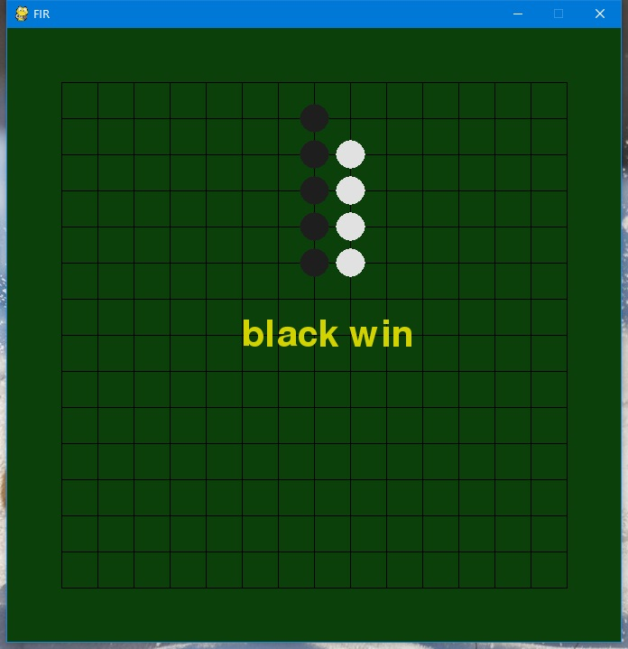

# PythonBox
本来计划上传打包好的的桌面应用程序，但是文件过大，无法上传，这是源码，会需要很多依赖，请自行下载，或加QQ893448322获得完整程序（无需安装环境依赖）

项目描述：python百宝箱，让我们在学习中改变生活。

项目环境：python爬虫+python3.5+tkinter+各种python的model，注意该项目中的三个爬虫需要在有网的情况下或得准确的实时数据。

# 项目截图

### 首页：

### 查天气：

### 英汉互译：
  

### 百度文库下载器：
   

### 表白小软件（只有选择“好的”，才会退出）：
 

### 压缩与解压缩：

### 本地音乐盒：
 

### 五子棋：
 

